# BitShares Gateway Official Documentation


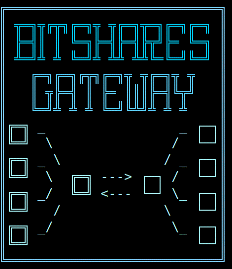


## Overview

The BitShares Gateway is a powerful solution for seamless interactions between different blockchain networks. This documentation provides a concise and clear overview of key components within the BitShares Gateway architecture.

### 1.0 Introduction

#### 1.1 Purpose

The BitShares Gateway facilitates interoperability between diverse blockchain networks, allowing gateway operators to automatically issue and reserve User Issued Assets (UIA) on Bitshares and listen for transactions on foreign chains.

#### 1.2 Key Components


 - db_setup.py - Execute this script before the first deposit to create a SQL database for transparent auditing of your gateway transactions.

 - db_ux.py - CLI visualization utility for the SQL database.   The SQL can also be queried in the traditional SELECT WHERE manner. 

 - Gateway.py - The main script orchestrating various subprocesses, offering admins a streamlined interface to launch BitShares Gateway.

 - config.py - Customize admin preferences crucial for gateway functionality from a single place, ensuring a tailored experience.

 - nodes.py - Maintains essential node endpoints for block operation listeners, vital for foreign chain connectivity these can be public or preferrably private nodes.

 - process_parachains.py - Standardizes foreign blockchain transfer listeners, ensuring consistency and compatibility across diverse networks.

 - process_deposits.py - Hosts a web based API and tracks user requests to deposit foreign chain coins, facilitating a seamless issuance process.

 - process_withdrawals.py - Listens on the BitShares blockchain for UIAs returned to the gateway operator, reserves them and facilitates user withdrawals.

 - process_ingots.py - Consolidates incoming deposits periodically, optimizing asset management for outbound withdrawal efficiency.

 - watchdog.py - Tracks subprocesses and sends custom alerts.   


### 1.3 Dependencies

The listed dependencies are Python modules that are not included in the standard library and need to be installed separately. Here's a brief description of each dependency:

1. **falcon:**
   - Falcon is a minimalist Python web framework for building web APIs. It is lightweight and designed to be easy to use.

2. **requests:**
   - Requests is a popular Python library for making HTTP requests. It simplifies the process of sending HTTP requests and handling responses.

3. **websocket-client:**
   - Websocket-client is a Python library for WebSocket communication. It allows the implementation of WebSocket clients for real-time communication.

4. **secp256k1:**
   - Secp256k1 is a Python wrapper for the secp256k1 library, which provides optimized elliptic curve cryptography operations. It is commonly used in cryptocurrency applications for handling cryptographic operations related to Bitcoin and other cryptocurrencies.

5. **ecdsa:**
   - ECDSA (Elliptic Curve Digital Signature Algorithm) is a Python library for performing ECDSA cryptographic operations. It is used for creating and verifying digital signatures.

To install these dependencies, you can use the following command in your Python environment. Make sure to run this command in the terminal or command prompt where your Python environment is active. This will download and install the specified dependencies, allowing your Python scripts to use the functionalities provided by these modules.

```bash
pip install -r requirements.txt
```

These following listed dependencies are Python modules that are embedded.  They are blockchain specific SDK's and are included with all dependencies in a frozen format.  If you decide to add new blockchains to the gateway it is recommended to freeze the SDK in the same manner via: 

```bash
mkdir signing/<new_sdk_folder>
touch signing/<new_sdk_folder>/__init__.py
pip install <new_sdk> --target signing/<new_sdk_folder>
```

These SDK's have already been frozen onboard:

1. **eosiopy:**
   - Eosiopy is a Python library for interacting with the EOSIO blockchain. It includes modules for handling EOSIO transactions, accounts, and other blockchain-related tasks.
   - 
2. **aioxrpy:**
   - Aioxrpy is a Python library for interacting with the Ripple blockchain. It provides functionalities for working with Ripple accounts, transactions, and other blockchain-related tasks.

3. **bitcoinrpc:**
    - BitcoinRPC is a Python library that provides a simple interface for communicating with Bitcoin Core's JSON-RPC API. It allows developers to interact with a Bitcoin Core node, making it easier to query information from the Bitcoin blockchain, create transactions, and manage wallet functionality.  BitcoinRPC also provides functionality for Litecoin blockchain. 


### 2. Usage

#### 2.1 Quick Demo

[Gateway Demo.webm](https://github.com/litepresence/BitShares-Gateway/assets/27382428/94b9ac96-1202-46a8-b7b8-6ca55552c578)

To demonstrate the functionality, ensure that "xyz" (the "paper blockchain" designed for unit testing) is configured in `config.py/offerings`. Then execute the following commands in the terminal:

```bash
python3 db_setup.py
python3 db_ux.py
```

Upon confirmation for database removal, the Database Explorer (DBUX) will be launched:


Use keys 1-3 to toggle the table "checkboxes" and display only deposits and withdrawals. In a separate terminal, initiate the gateway by running:

```bash
python3 Gateway.py
```

This will initialize the gateway, accompanied by the playback of the theme song and logo animation.  Following this, the startup screen will appear, showing the current block of the XYZ chain and the server's hosted IP:

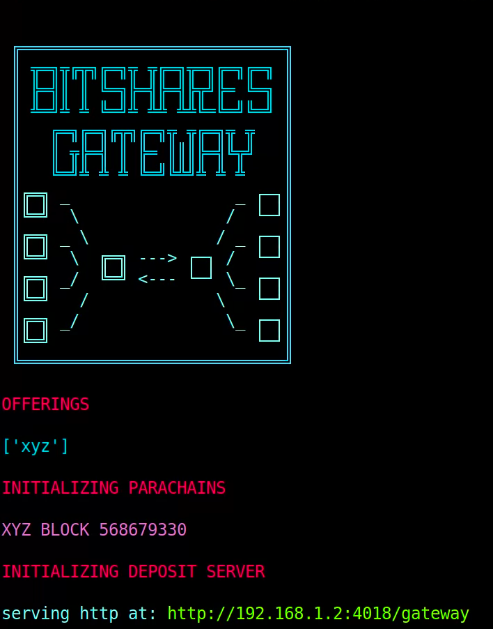

Next, to execute the unit test script to perform XYZ token deposits and withdrawals, run the following command in another terminal:

```bash
python3 unit_test_xyz_deposit_withdraw.py
```

The terminal displaying the gateway's operation will output a banner indicating the deposit request and the gateway's readiness to receive deposits:

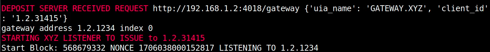

Similarly, the DBUX will log the deposit request:


As the parachain picks up blocks, you will observe the corresponding parachain and BitShares blocks:

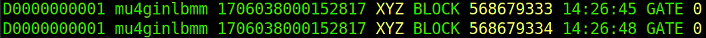


Upon the successful detection of the deposited XYZ "tokens," the gateway will acknowledge the deposit by initiating the signing process to issue tokens:

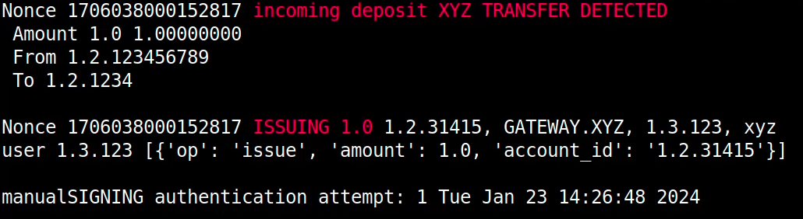

Since this is a unit test, the absence of authentication keys will cause the signing process to fail:

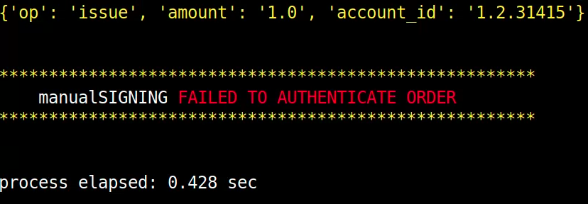

The DBUX will also log the unsuccessful attempt to issue tokens:


Following this, the unit test script will proceed to send a withdrawal request, which the gateway will acknowledge:

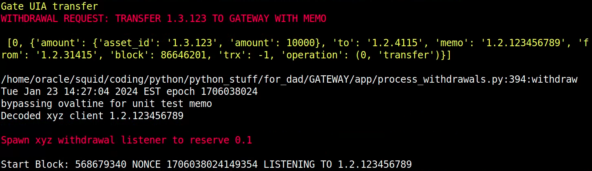
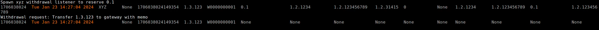

The gateway will then listen for the withdrawal:

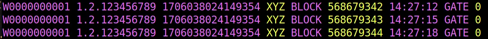

Approximately 10 XYZ blocks later, the gateway will announce the successful transfer:

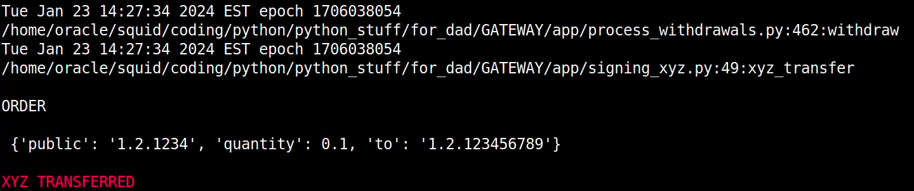
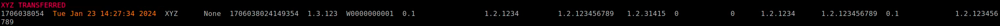

After a few more blocks, the gateway will attempt to act on the transfer by initiating the reservation process:

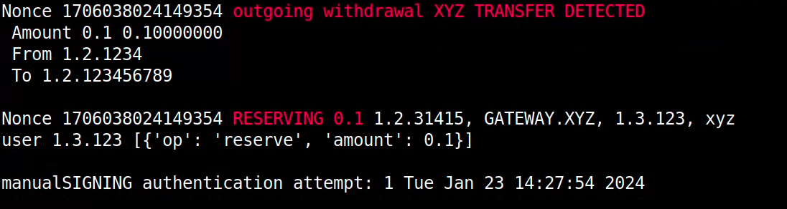
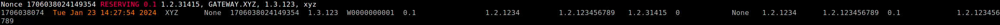

As expected in a unit test, the signing process for the reserve transaction will also fail:

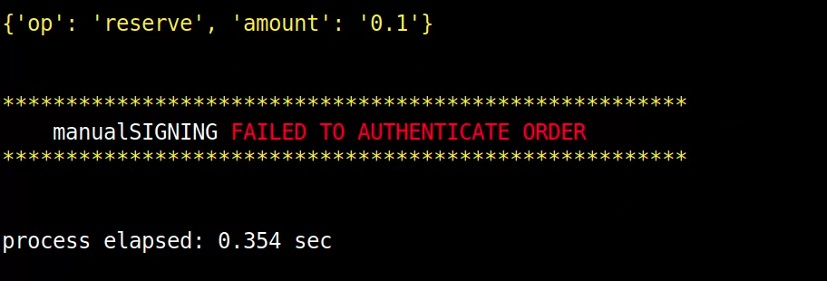

*Test Completed!*

-------------------------------

Conclude the demonstration by terminating both the DBUX and the gateway using two "Ctrl + C" keypresses in each terminal.


#### 2.2 In-Depth


The administrator should fully aquaint themselves with the key components and fill out the `config.py` with pertinent information.

Consider adding custom blockchain listeners in the prescribed "xyz" pattern with chain specific SDK's as described later in this document. 

Perform all unit tests:

```bash
python3 unit_test_transfer_xyz.py
python3 unit_test_transfer.py
python3 unit_test_supply.py
python3 unit_test_issue.py
python3 unit_test_deposit_concurrency.py
python3 unit_test_db.py
python3 unit_test_client.py
```

Additionally the process scripts each has a main() that serves as a unit test:

```bash
python3 process_withdrawals.py
python3 process_parachains.py
python3 process_ingots.py
python3 process_deposits.py
```

After all tests are complete, to initiate the BitShares Gateway, the administrator simply runs the script in the terminal using:

```bash
python3 Gateway.py
```

### 3. Technical File Descriptions

## Gateway.py - BitShares Gateway Main Script

### Overview

`Gateway.py` serves as the central script for the BitShares Gateway, providing a user-friendly interface for administrators to initiate all processes concurrently.

### Script Structure

#### 1. Deposit and Issue Process

- Provides a highly concurrent web API for clients to request a gateway deposit address.
- Generates a unique address for each client to deposit foreign tokens.
- Listens for incoming foreign tokens on parachains and `issues UIA` to the client.

#### 2. Withdrawal and Reserve Process

- Listens for incoming UIA to the gateway address via a Graphene listener.
- Confirms the legitimacy of the transfer memo as a foreign chain address.
- Initiates withdrawal transfer of foreign chain tokens to the client.
- Listens to the foreign chain to confirm the transfer and `reserve UIA` back to the supply.

#### 3. Ingot Process

- Periodically checks foreign chain gateway wallets.
- Consolidates ingots of deposits into a single hot wallet to facilitate later withdrawals

#### 4. Parachain Process

- Writes concise, windowed, apodized blocks of each blockchain offered by the gateway to disk in a standarized format that only includes pertinent information to the gateway operations.

### Subprocess Management

The script utilizes Python's multiprocessing module for concurrent subprocesses, allowing multiple clients to deposit or withdraw various tokens on multiple blockchains simultaneously.

## process_parachains.py - Parachain Management Script

### Overview

`process_parachains.py` maintains a windowed parachain for each foreign blockchain network specified in `config.py` facilitating seamless interactions within each ecosystem.

### Script Structure

#### 1. Block Number and Apodization Functions

- `get_block_number(network: str) -> int`: Returns the irreversible block number function for each network.
- `apodize_block_data(network: str) -> Any`: Returns the apodize function for each network.

#### 2. spawn_parachains Function

- Launches parachain subprocesses for each network listed in the offerings.

#### 3. window_parachain Function

- Maintains a windowed parachain in the pipe folder (parachain_{network}.txt).
- Checks for new blocks, retrieves block data, and updates the parachain accordingly.
- Manages the frequency of parachain writes to avoid excessive updates.

#### 4. unit_test_parachains Function

- Initiates a unit test to launch parachains in the pipe folder for networks in the configuration offerings.

### Subprocess Management

The script utilizes Python's multiprocessing module for concurrent subprocesses, improving overall efficiency.

### Dependencies

Relies on custom modules (eg. parachain_eosio, parachain_ltcbtc, parachain_ripple) which standarize block data for each respective chain. 

## process_deposits.py - Falcon API Server for Gateway Deposit Requests

### Overview

`process_deposits.py` provides a very fast and highly concurrent API server to handle deposit requests for the BitShares Gateway, ensuring a seamless user experience.

### Script Structure

#### 1. GatewayDepositServer Class

- Initializes the API server instance.
- Handles GET requests to the deposit server API.
- Generates deposit addresses, issues UIA, and starts listener threads for deposit confirmation.

#### 2. on_get Method

- Handles GET requests to the deposit server API.
- Processes user requests, allocates deposit addresses, and initiates UIA issuance.

#### 3. deposit_server Function

- Initializes and starts the Falcon API server to handle deposit requests.
- Configures routing information for the API.

#### 4. unit_test Function

- Performs a unit test of the deposit server.
- Outputs information about the initialization and offerings.

### Address Allocation and UIA Issuance

The script employs an address allocation mechanism for each supported network, issuing UIA upon confirming the deposit.

### Threading for Deposit Listeners

Separate threads for each deposit listener run concurrently, efficiently handling multiple deposit requests.

### Server Configuration

Configured based on parameters such as URL, port, and route specified in the config.py module.

### Embedded WSGI

There is no need for the admin to set up a wsgi server, its all onboard.

## process_ingots.py - Asset Management Script

### Overview

process_ingots.py efficiently manages incoming deposits across multiple blockchain networks, consolidating funds for streamlined withdrawals.

### Script Structure

#### Constants and Configuration

Defines constants related to configuration, such as maximum unspent transactions, nil balances, offerings, and timing settings.

#### Functions

- `ingot_casting(comptroller)`: Continuously checks incoming accounts and moves funds to outbound accounts.
- `gateway_balances(network=None)`: Prints balances for different networks.
- `unit_test_ingots()`: A unit test demonstrating recycling processes.


## db_setup.py - Database Initialization Script

### Overview

db_setup.py sets up and initializes an SQLite3 database with the correct schema for auditing gateway transactions.

### Execution

- Checks Python version for compatibility (requires Python 3.8 or higher).
- Creates the database folder if it doesn't exist.
- Displays a warning about erasing the existing database and prompts the user for confirmation.
- If confirmed, moves the existing database to a backup location.
- Creates a new SQLite3 database at the specified location (DB variable in the config module).
- Defines and executes SQL queries to create tables for block numbers, withdrawals, deposits, and ingots.
- Displays information about the created tables, including column details.


## config.py - Configuration Settings

### Overview

config.py contains critical settings for the gateway system, including blockchain-specific details, fee structures, timing parameters, and more.

### Key Sections and Settings

- `offerings()`: Initializes gateways listed in the offerings.
- `processes()`: Selects which processes to enable.
- `parachain_params()`: Adjusts parameters for windowed parachains (blockchains).
- `contact()`: Specifies the gateway admin support email.
- `server_config()`: Configures the port number for the deposit server.
- `logo_config()`: Enables/disables startup logo animation and audio.
- `fees()`: Configures fees for gateway use in the listeners.
- `timing()`: Periodically fine-tunes gateway timeouts in seconds.
- `nil()`: Sets nil amounts for different blockchains.
- `max_unspent()`: Specifies the maximum number of addresses with dust before consolidating an ingot.
- `issuing_chain()`: Specifies the core token and chain ID.
- `gateway_assets()`: Specifies gateway user-issued assets for different blockchains.
- `foreign_accounts()`: Specifies foreign chain public and private keys.
- `test_accounts()`: Specifies test client account information for unit tests.

## nodes.py - Blockchain Nodes Configuration

### Overview

nodes.py defines public API endpoints for various blockchain networks, enabling the system to interact with and query information from these networks.

### Functions

- `bitshares_nodes()`: Returns a list of Bitshares WebSocket endpoints.
- `eosio_node()`: Returns a remote EOSIO node endpoint.
- `bitcoin_node()`: Returns information about a Bitcoin node.
- `litecoin_node()`: Returns information about a Litecoin node.
- `ripple_node()`: Returns a remote Ripple node endpoint.
- `unit_test_nodes()`: Prints out the list of nodes in use by the Gateway.


# Creating a Custom Parachain File for a Foreign Blockchain

Creating a parachain file for another blockchain involves adapting the existing template for the specific characteristics and functionalities of the target blockchain. Below are clear steps to guide you through this process, emphasizing the critical elements of integration.

## Steps to Create a Parachain File for Another Blockchain:

1. **Identify Blockchain Characteristics:**
   - Determine the unique features of the target blockchain, such as account verification, block retrieval, and transaction details.

2. **Account Verification Function:**
   - Create a function to verify the validity of accounts on the target blockchain.
   - Example: In the Ripple example, the `verify_ripple_account` function checks if a Ripple address is valid.

3. **Block Number Retrieval Function:**
   - Implement a function to retrieve the current block number or the last irreversible block number on the target blockchain.
   - Example: In the EOSIO example, the `get_block_number` function retrieves the last irreversible block number.

4. **Block Data Retrieval Function:**
   - Develop a function to fetch block data for a given block number.
   - Customize the function to handle the specific block data format of the target blockchain.
   - Example: In the EOSIO example, the `eos_block_cache` and `get_block` functions fetch block data for EOSIO.

5. **Apodize Block Data Function:**
   - Create a function to apodize block data, extracting relevant information for the parachain.
   - Customize the function to handle transaction details, including sender, recipient, memo, hash, asset, and amount.
   - Example: The `apodize_block_data` function builds a parachain fragment from retrieved block data.

```python
# Every transfer for every blockchain has the same parachain format
transfer = {
    "to": trx_to,
    "from": trx_from,
    "memo": trx_memo,
    "hash": trx_hash,
    "asset": trx_asset,
    "amount": trx_amount,
}
transfers.append(transfer)

# Build parachain fragment of transfers for new blocks
parachain[str(block_num)] = transfers
```

6. **Adjust Constants and Parameters:**
   - Modify constants and parameters, such as network identifiers, request timeouts, and specific blockchain details.
   - Adjustments are made in the `comptroller` dictionary and other configuration sections.

7. **Handle Specifics of the Target Blockchain:**
   - Address any blockchain-specific intricacies in the code, such as adjusting transaction amount calculations, handling different transaction types, or managing specific contract interactions.

8. **Error Handling:**
   - Implement error handling mechanisms to manage exceptions and ensure the reliability of the parachain script.

9. **Testing:**
   - Perform thorough testing to verify the functionality of the parachain script.
   - Unit tests, particularly for account verification and block retrieval, are essential to ensure accuracy.


## Example Template for a New Parachain File:

```python
# Import necessary modules and functions

def verify_XYZ_account(account: str, comptroller) -> bool:
    # Implement account verification for the target blockchain
    pass

def get_XYZ_block_number(_) -> int:
    # Retrieve the current block number or last irreversible block for the target blockchain
    pass

def XZY_block_cache(new_blocks: List[int]) -> Dict[int, Dict]:
    # Implement block caching for the target blockchain
    pass

def apodize_XYZ_block_data(
    comptroller: Dict[str, Union[str, int]], new_blocks: List[int]
) -> Dict[str, List[Dict[str, Union[str, float]]]]:
    # Customize the apodize function for the target blockchain
    pass

# Additional functions and constants specific to the target blockchain
```

Remember to replace "XYZ" with the actual name of the target blockchain, and customize the functions according to the blockchain's API and data format.

**Note:** The provided template is a starting point, and the specifics may vary based on the target blockchain's characteristics and APIs. Always refer to the target blockchain's documentation for accurate information.

# Integrating a New Blockchain's Signing SDK to the Gateway

Attaching the signing SDK provided by each foreign blockchain to the gateway involves integrating the specific SDK functions for creating and signing transactions. Below is a clear guide on how to adapt existing examples for Ripple, EOSIO, Litecoin, and Bitcoin to add support for a new blockchain.

## Steps to Attach the Signing SDK to the Gateway:

1. **Identify the Signing SDK:**
   - Choose the SDK provided by the foreign blockchain for transaction signing.
   - Familiarize yourself with the SDK's documentation, especially functions related to creating, signing, and broadcasting transactions.

2. **Create Balance Retrieval Function:**
   - Implement a function to retrieve the balance for the given blockchain.
   - Customize this function according to the methods provided by the SDK.
   - In the existing examples, functions like `xrp_balance`, `eos_balance`, `ltcbtc_balance` handle balance retrieval.

3. **Create Transaction Execution Function:**
   - Develop a function that executes the transaction using the SDK.
   - This function should take an order (transaction details) as input and handle the transaction creation, signing, and broadcasting.
   - Refer to examples like `xrp_transfer_execute`, `xrp_transfer`, `eos_transfer`, `ltcbtc_transfer`.

4. **Adapt Existing Transfer Functions:**
   - Modify the existing transfer functions (`xrp_transfer`, `eos_transfer`, `ltcbtc_transfer`) to use the new transaction execution function.
   - Pass the order details and comptroller information to the transaction execution function.

5. **Security Considerations:**
   - Carefully review and ensure the security of the transaction execution process.
   - Evaluate the security implications of using private keys for signing transactions.

6. **Testing:**
   - Perform thorough testing of the integration to ensure correct balance retrieval and successful transaction execution.
   - Test with both positive and negative scenarios to cover different cases.

## Example Template for New Blockchain Integration:

```python
# Import necessary modules and functions

def new_balance(account, comptroller):
    """
    Retrieve balance for the new blockchain using the SDK.
    """
    # Implement balance retrieval using the SDK
    pass

def new_transfer_execute(order):
    """
    Execute a transaction on the new blockchain using the SDK.
    """
    # Implement transaction execution using the SDK
    pass

def new_transfer(order, comptroller):
    """
    Wrapper for the new blockchain transfer operation.
    """
    # Use new_transfer_execute to execute the transaction
    pass

def unit_test_new_transfer():
    """
    UNIT TEST for the new blockchain transfer.
    """
    # Implement a test scenario for the new blockchain transfer
    pass

if __name__ == "__main__":
    unit_test_new_transfer()
```

Remember to replace "new" with the actual name of the target blockchain, and customize the functions based on the provided SDK documentation and functionality. Always prioritize security and conduct thorough testing before deploying to a live environment.

## Order Format for Transfers on the Gateway

The order format required for executing transfers on the gateway is standardized for all blockchains, regardless of the functions used for transaction execution in their SDK.

```python
order = {
    "private": "private_key",  # Private key for signing the transaction
    "public": "public_address",  # Public address associated with the private key
    "to": "recipient_address",  # Recipient's address for the transfer
    "quantity": 10.0,  # Amount of the cryptocurrency to be transferred
}
```

This format includes essential details such as private key, public address, recipient's address, and the quantity of cryptocurrency to be transferred. Ensure that these details are correctly provided when initiating transfers on the gateway.


